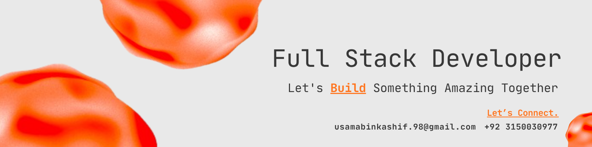

<a href="https://browndev.vercel.app/">
  <picture>
    <source media="(prefers-color-scheme: dark)" srcset="./header-dark.png" />
    <source media="(prefers-color-scheme: light)" srcset="./header-light.png" />
    
  </picture>
</a>

# What I'm Up To

- Currently working as **Full Stack Developer**.
- Deep diving into **AI**, **DevOps** and **Cloud Infrastructure**.
- Building **HireSpark**, an AI-powered HR automation platform that streamlines recruitment — from job posting to candidate analysis.
- Always open to collaborating on creative, impactful tech projects

# Tech Stack

- **AI-Tools**

Using advanced AI tools like OpenAI, Google Gemini and BFL for integrations such as chatbots, image generation, text-to-speech, and speech-to-text — while Claude and Cursor assist in rapid prototyping, improving code quality, and designing scalable, efficient system architectures that drive innovation and development excellence.

- **Frontend**

Building modern, responsive, and scalable user interfaces using React, Next.js, and TypeScript — styled with Tailwind CSS, Sass, and shadcn/ui. Experienced in state management with Redux, React Query, and React Hook Form, ensuring seamless user experience, maintainable architecture, and production-grade performance.

- **Backend & Infrastructure**

Developing robust backend systems and infrastructure with Node.js, Express.js, Fastify, and NestJS, integrating databases (Postgres, MongoDB, Redis, Supabase) with ORMs (Prisma, Sequelize), implementing API testing (Jest, Playwright), and managing deployments and CI/CD pipelines (GitHub Actions, Docker, Vercel) to ensure scalable, maintainable, high-performance applications with seamless cloud and real-time integrations.

- **Design & Tools**

Utilizing modern design and productivity tools such as Figma, Notion, Jira, Slack, and Trello to streamline project management, team collaboration, UI/UX design, and agile workflow, ensuring efficient and well-coordinated product development.

## I'm always open to discussing new projects, creative ideas, or opportunities to be part of your vision.

